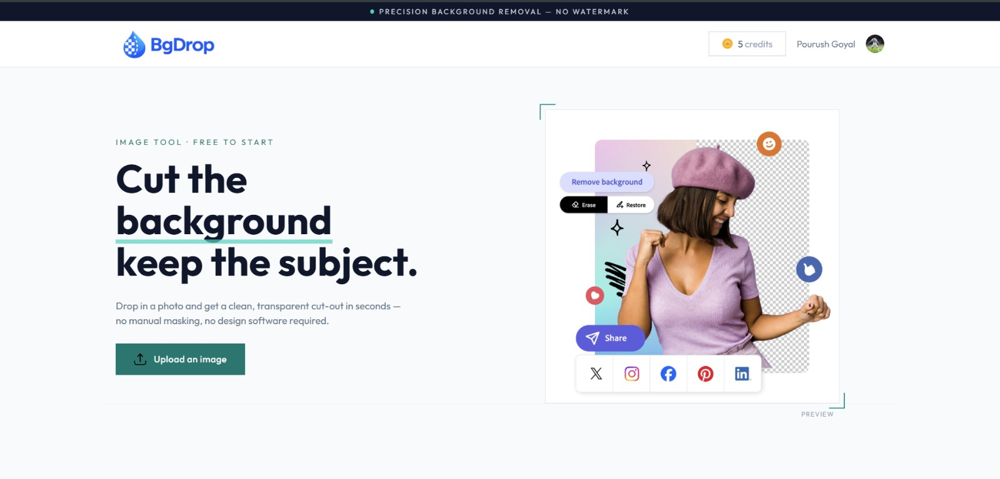
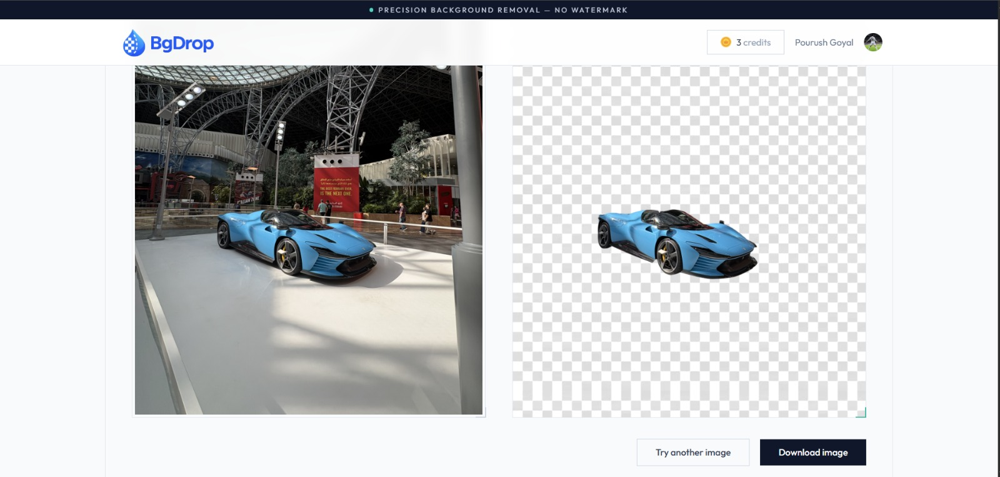
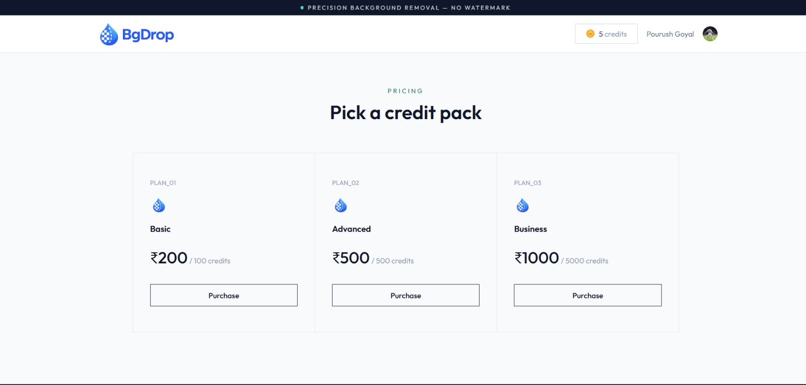

# 🎨 BgDrop

**BgDrop** is an AI-powered background removal web application that lets users remove image backgrounds in seconds using the Clipdrop API. The application features secure authentication with Clerk, a credit-based system, and Razorpay payment integration for purchasing additional credits.

---

## 🚀 Live Demo

🌐 **Application:** *(Coming Soon)*

---

## ✨ Features

- 🔐 Secure Authentication using Clerk
- 🖼️ AI-powered Background Removal
- 💳 Credit-based Usage System
- 💰 Purchase Credits using Razorpay
- 📥 Download Processed Images
- 📱 Fully Responsive Design
- ⚡ Fast & Modern UI built with React and Tailwind CSS

---

## 🛠️ Tech Stack

### Frontend

- React.js
- Vite
- Tailwind CSS
- Axios
- React Router DOM
- Clerk Authentication
- React Toastify

### Backend

- Node.js
- Express.js
- MongoDB
- Mongoose
- Multer
- Clerk Express SDK
- Razorpay SDK

### APIs

- Clipdrop Background Removal API
- Razorpay Payment Gateway

---

## 📸 Screenshots

### 🏠 Home Page



---

### ✨ Background Removal



---

### 💳 Buy Credits



---

## 📂 Folder Structure

```text
BgDrop
│
├── backend
│   ├── config
│   ├── controllers
│   ├── middlewares
│   ├── models
│   ├── routes
│   └── server.js
│
├── frontend
│   ├── src
│   ├── public
│   └── package.json
│
└── README.md
```

---

## ⚙️ Installation

### 1. Clone the Repository

```bash
git clone https://github.com/beingpourush/BgDrop.git
cd BgDrop
```

---

### 2. Install Backend Dependencies

```bash
cd backend
npm install
```

---

### 3. Install Frontend Dependencies

```bash
cd ../frontend
npm install
```

---

### 4. Configure Environment Variables

Create a `.env` file inside both the `backend` and `frontend` directories.

#### Backend (`backend/.env`)

```env
MONGODB_URI=

CLERK_SECRET_KEY=
CLERK_WEBHOOK_SECRET=

CLIPDROP_API_KEY=

RAZORPAY_KEY_ID=
RAZORPAY_KEY_SECRET=
CURRENCY=INR
```

#### Frontend (`frontend/.env`)

```env
VITE_BACKEND_URL=http://localhost:4000
VITE_CLERK_PUBLISHABLE_KEY=
VITE_RAZORPAY_KEY_ID=
```

---

### 5. Start the Backend

```bash
cd backend
npm run server
```

---

### 6. Start the Frontend

Open a new terminal and run:

```bash
cd frontend
npm run dev
```

---

### 7. Configure Clerk Webhooks (Development Only)

To receive Clerk webhook events during local development, expose your backend using **ngrok**.

```bash
ngrok http 4000
```

Copy the generated HTTPS URL and configure your Clerk webhook endpoint as:

```text
https://<your-ngrok-url>/api/webhooks
```

> **Note:** ngrok is only required for local development. When the backend is deployed, update the Clerk webhook to point to your deployed backend URL instead.
---

## 🔑 Environment Variables

### Backend (`backend/.env`)

```env
MONGODB_URI=

CLERK_SECRET_KEY=
CLERK_WEBHOOK_SECRET=

CLIPDROP_API_KEY=

RAZORPAY_KEY_ID=
RAZORPAY_KEY_SECRET=
CURRENCY=INR
```

### Frontend (`frontend/.env`)

```env
VITE_BACKEND_URL=
VITE_CLERK_PUBLISHABLE_KEY=
VITE_RAZORPAY_KEY_ID=
```

---

## 📖 How It Works

1. User signs in using Clerk.
2. User uploads an image.
3. Image is sent to the backend.
4. Backend forwards the image to the Clipdrop API.
5. Background-removed image is returned.
6. One credit is deducted after a successful operation.
7. Users can purchase additional credits via Razorpay.

---

## 🔒 Security Features

- Clerk Authentication
- Protected Backend APIs
- Secure Razorpay Payment Verification
- Environment Variables for API Keys
- Credit Validation before Background Removal

---

## 👨‍💻 Author

**Pourush Goyal**

- GitHub: https://github.com/beingpourush

---

## ⭐ Support

If you found this project useful, consider giving it a ⭐ on GitHub!